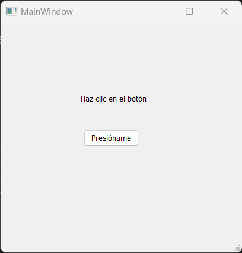
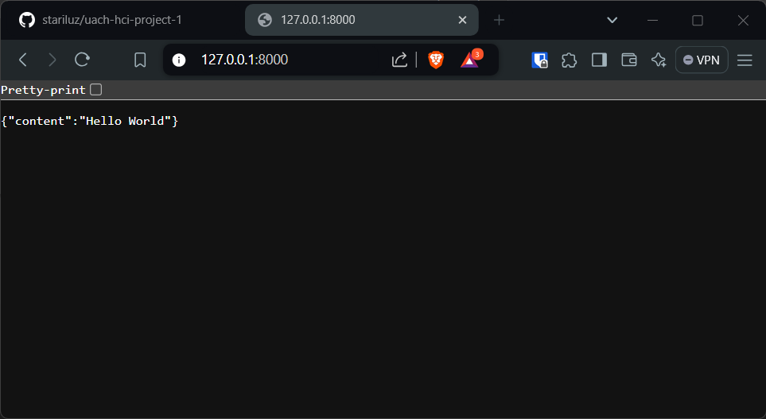
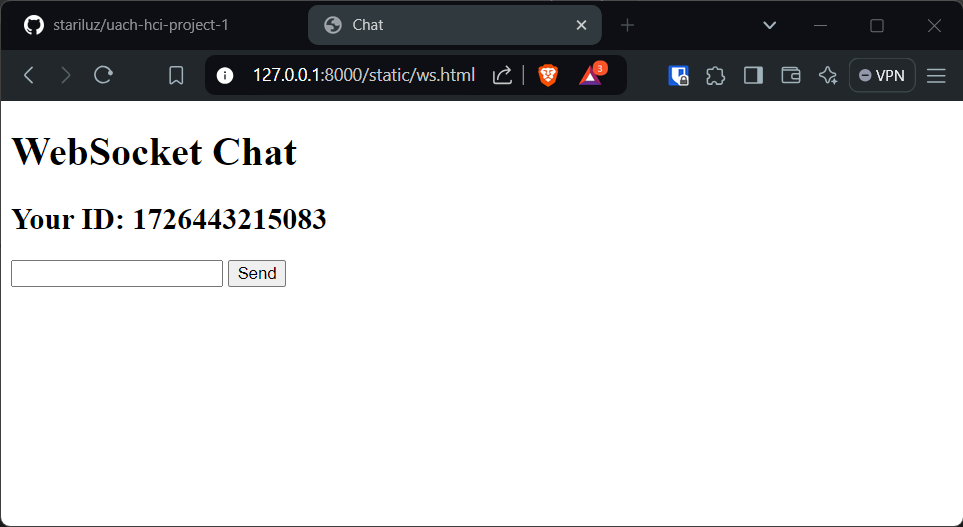
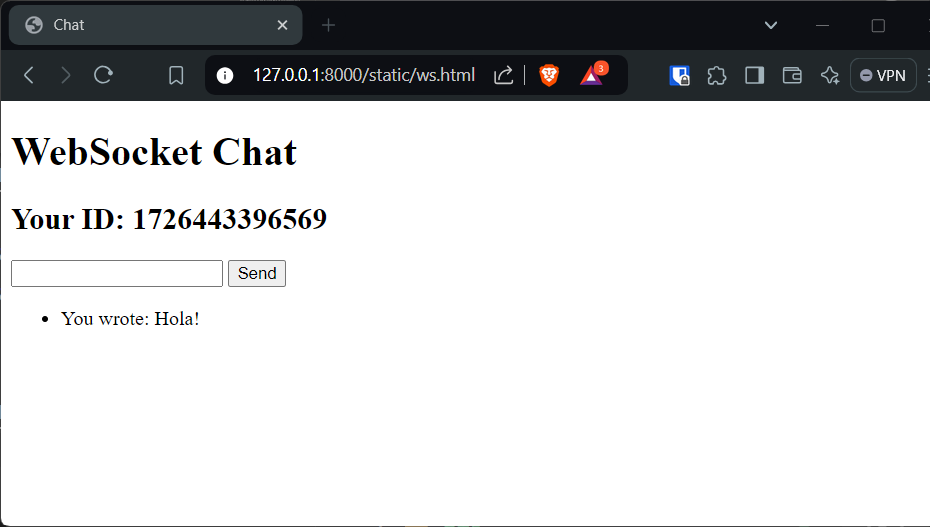
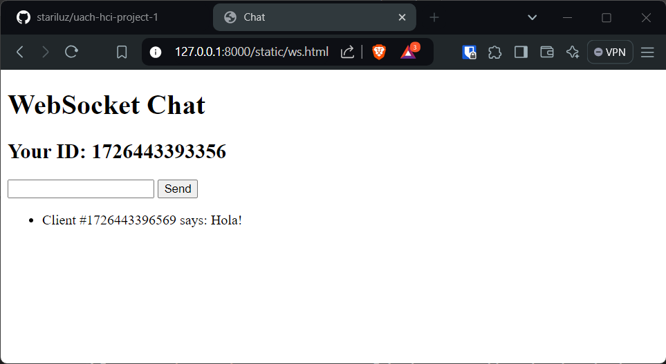
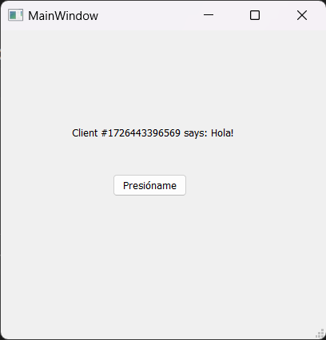
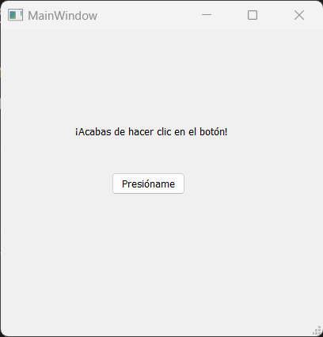
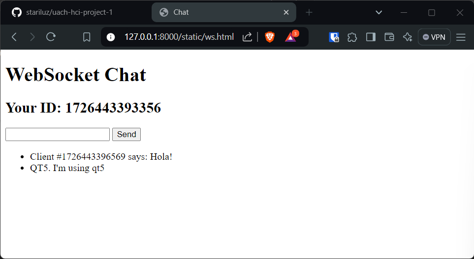
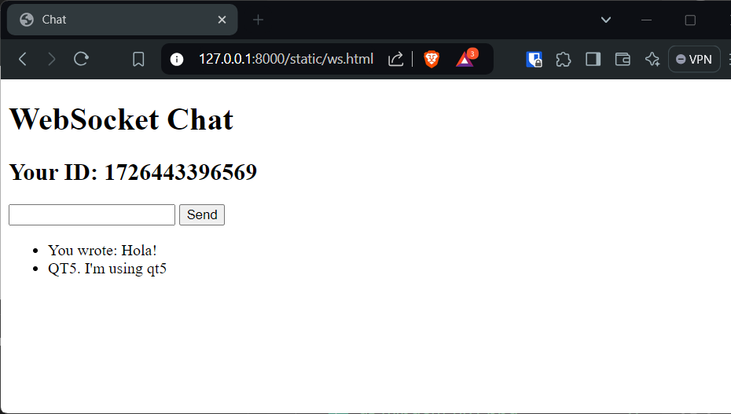

# Event Bus para conectar QT5 app y Web Sockets 

Este repositorio es una práctica para la interconexión entre
modulos de Python enfocados en distintas tareas, mediante el uso de un Event Bus central.  
Hasta el momento se ha conectado un módulo que ejecuta una aplicación de QT5, y un modulo que ejecuta un servidor web con endpoints que utilizan web sockets.
A posterior, se añadirá un modulo para un microcontrolador ESP-32 para comunicarlo también con los demás modulos.

## Getting Started

Cada modulo puede funcionar por separado, aunque las instalaciones para este ejemplo la haremos en la ruta del proyecto para que funcionen de manera integrada, bien pudieran hacerse individualmente en la carpeta del modulo.

> **Nota.** Este tutorial se realizó en Windows, no obstante, se
> hizo en la consola *Git Bash*, que es tipo UNIX. Es muy probable
> que algunos de los comandos que se enlistarán no funcionen desde
> *CMD* o *PowerShell*. Recomiendo encaresidamente que se utilice
> una consola tipo UNIX.

### Descarga el proyecto

Puedes descargar el [zip del proyecto](https://github.com/stariluz/uach-hci-project-1/archive/refs/heads/main.zip), o bien, clonarlo desde la consola:

```sh
git clone git@github.com:stariluz/uach-hci-project-1.git
cd uach-hci-project-1
```

### Instalar dependencias

Primero, habremos de crear y activar un entorno virtual en la version `3.10.11` de Python:

```sh
# Using python 3.10.11
pythoh -m venv venv
source venv/Scripts/activate
```

Ahora si procedemos a la instalación de las dependencias:

```sh
pip install -r ./api/requirements.txt -r ./QT5/requirements.txt -r ./event_bus/requirements.txt
```

Y listo, nuestro proyecto está listo para ser ejecutado.

## Ejecución

Para ejecutar el proyecto, hay que correr el archivo main:

```sh
python main.py
```

Lo cual abrira una ventana de qt:



Y en la consola mostrará lo siguiente:
```sh
$ python main.py 
WARNING: QApplication was not created in the main() thread.
INFO:     Started server process [13488]
INFO:     Waiting for application startup.
INFO:     Application startup complete.
INFO:     Uvicorn running on http://127.0.0.1:8000 (Press CTRL+C to quit)
```

Si abrimos la ruta que nos dice `http://127.0.0.1:8000` veremos:



### Utilizar web sockets

Para acceder a el uso de los web sockets, debemos navegar a `http://127.0.0.1:8000/static/ws.html` que es nuestro archivo creado para tener un chat de grupo comunicado con esta tecnología. Al ingresar veras lo siguiente:



Manteniendo esta pantalla abierta, si abrimos una nueva ventana y mandamos un mensaje, veremos que en la primera pantalla aparece el mensaje enviado, con el ID de la pantalla:

**Ventana 2**



**Ventana 1**



### Conexion entre web sockets y QT 

Se configuraron eventos para que cada vez que los web sockets se comuniquen, o la aplicacion en QT5 se comunique, nos notifique en la consola. Con el ejemplo anterior, si revisamos nuestra consola, recibimos el siguiente log:

```sh
INFO:     connection closed
INFO:     ('127.0.0.1', 56042) - "WebSocket /ws/1726443393356" [accepted]
INFO:     connection open
INFO:     ('127.0.0.1', 56044) - "WebSocket /ws/1726443396569" [accepted]
INFO:     connection open
WS. Client #1726443396569 says: Hola!
Message event. Client #1726443396569 says: Hola!
```

Así mismo la aplicación en QT5 reaccionó al mensaje enviado:



Si presionamos el boton en QT5, nuevamente, tanto la consola, como
las páginas conectadas con web sockets reaccionarán a esta acción:

**Ventana de QT5**



**Ventana 1**



**Ventana 2**



Todo esto funciona gracias a que se estan notificando y esperando los
eventos mediante el Event Bus.

## Aspectos importantes del código

### Programación en modulos

Estos programas actualmente se están ejecutando de manera
centralizada para que funcionen bajo el mismo event bus, 
en un caso real, cada programa se ejecuta por separado,
en diferentes servidores y hasta en diferentes 
localizaciones. Por esto, decidí separar lo mayor posible
los comportamientos de cada modulo, de manera que cada uno se encargue exclusivamente de lo que de el depende.

Para poder ejecutar nuestros modulos individualmente solo
corremos:
```sh
python -m QT5
python -m api
python -m event_bus
```

Esto funciona gracias a los archivos `__main__.py` que cada
carpeta contiene, que le indica al modulo que hacer cuando es
ejecutado por separado.

### Servidor web con uvicorn

FastApi nos puede disponer un servidor web con una app de fastapi,
no obstante, no va a ejecutar otras acciones de nuestro código,
solamente aquellas que a FastApi le concierne.

Dado que los modulos se diseñaron para integrarse en un punto central,
requerimos poder ejecutar nuestro código con los comandos de Python
y no los de FastAPI, para lo cual utilizamos `uvicorn`:

```py
import uvicorn

# ...

def run():
    config = uvicorn.Config(ws_app, host="127.0.0.1", port=8000, log_level="info")
    server = uvicorn.Server(config)
    server.run()

# ...
```

### Integrar EventBus con funciones asíncronas

Un problema que enfrenté al realizar el trabajo, es que para que el
Web Socket se comuniqué con los clientes, necesitamos realizar
llamadas asíncronas. Dado que el EventBus requiere notificar al
Web Socket, y el primero no maneja asincronía por defecto,
necesitamos una forma de poder hacer la comunicación.

Para ello utilizamos `asyncio`:

```py
import asyncio

# ...

@EventBus.on("qt5_message")
def qt5_message(message):
    loop = asyncio.new_event_loop()
    threading.Thread(target=run_coroutine, args=(loop, message)).start()

def run_coroutine(loop, message):
    asyncio.set_event_loop(loop)
    loop.run_until_complete(manager.broadcast(f"QT5. {message}"))
    
# ...
```

Asyncio nos permitio llamar una funcion asíncrona desde una función
síncrona, creando un loop artificial que se ejecutará hasta que la
función asíncrona termine.

### Integrar EventBus con metodos de clase

No podemos colocar un decorador a un metodo de una clase a menos que
este esté diseñado dentro de la misma clase, de lo contrario,
tendremos un problema ya que el decorador de EventBus funciona solo
entregando los datos que enviemos, pero el metodo de la clase espera
el parámetro `self`.

Tuve que crear una variable global que guardará la ventana. Al momento
de recibir el evento, lo notificamos a la función interna de la
ventana para que se actualice.

```sh
# ...

main_window=None

class MainWindow(QtWidgets.QMainWindow, first_screen_ui.Ui_MainWindow):
    
    # ...

    def ws_message(self,message):
        self.label.setText(f"{message}")

@EventBus.on("ws_message")
def ws_message(message):
    main_window.ws_message(message)

def init_main_window():
    global main_window
    main_app = QtWidgets.QApplication([])
    main_window = MainWindow()
    main_window.show()
    main_app.exec_()
```

### Cerrar ventana de QT5 mediante una interrupción de teclado
Por defecto, la ventana de QT5 no se puede cerrar desde consola con
el comando `Ctrl+C`. 
Encontré la solución aquíÑ
[#5160577 Ctrl-C doesn't work with PyQt [duplicate]](https://stackoverflow.com/questions/5160577/ctrl-c-doesnt-work-with-pyqt/5160720#5160720)

Todo lo que hay que realizar es agregar esté código en el archivo que
inicia nuesta aplicación de QT5:

```sh
import signal
signal.signal(signal.SIGINT, signal.SIG_DFL)
```

## Licencia

Este proyecto se encuentra bajo la [licencia GNU General Public License](./license.md).

## Autoría

Este es un trabajo de Adrian (Adora) González [[@stariluz](https://github.com/stariluz)] para la materia de **Interacción Humano Computadora** de la *Facultad de Ingeniería de la Universidad Autónoma de Chihuahua*.

El catedrático y asesor de la materia es el mtro. Oscar Beltrán Gómez
[[@oscarbego](https://github.com/oscarbego)]
